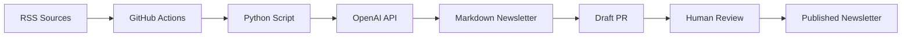

# MitiMind AI Newsletter Automation

Automated AI newsletter system for Mitigram's Product-Led Development transformation. This system curates, summarizes, and generates weekly AI newsletters with 90-95% automation and human-in-the-loop review.

## 🎯 Purpose

Support Mitigram's transition from "Feature Factory" to Product-Led Development by:
- Increasing AI literacy across all departments (business, tech, product, design)
- Encouraging innovation and cross-pollination of ideas
- Providing real-time industry awareness for data-driven decision-making
- Empowering autonomous, cross-functional teams with relevant AI knowledge

## 🚀 How It Works



### Workflow Steps
1. **Scheduled Trigger** - GitHub Actions runs every Monday at 8:00 AM UTC
2. **Feed Fetching** - Pulls latest content from curated AI and trade finance sources
3. **Content Ranking** - Scores items based on relevance to PLD transformation
4. **AI Summarization** - OpenAI creates newsletter draft with structured sections
5. **Quality Gates** - Validates word count, source links, and required sections
6. **PR Creation** - Automatically opens draft PR for human review and approval

## 📋 Setup Instructions

### 1. Repository Setup
```bash
# Clone or ensure this directory structure exists:
miti-ai-newsletter/
├── .github/workflows/generate-newsletter.yml
├── scripts/generate.py
├── sources.yml
├── requirements.txt
├── newsletter/          # Auto-created output directory
└── README.md
```

### 2. GitHub Configuration

#### Required Secrets
Add these in **Settings → Secrets and Variables → Actions**:
- `OPENAI_API_KEY` - Your OpenAI API key with GPT-4 access

#### Repository Permissions
Ensure GitHub Actions has permission to:
- Read repository contents
- Create pull requests  
- Write to repository (Settings → Actions → General → Workflow permissions)

### 3. Customization

#### RSS Sources (`sources.yml`)
Current sources are categorized by:
- **Trade Finance & Fintech** - Industry-specific news
- **AI & Technology** - Core AI developments
- **Business & Strategy** - Transformation insights
- **Product & Development** - PLD methodologies

Add/remove sources as needed for your organization's focus areas.

#### Content Scoring (`scripts/generate.py`)
The ranking algorithm prioritizes content with keywords relevant to:
- AI/ML technologies (weight: 3)
- Business transformation terms (weight: 2) 
- Industry terms (weight: 1)
- PLD-specific terms (weight: 2)

#### Newsletter Template
The AI generates structured content with these sections:
1. **AI in Trade Finance** - Industry-specific developments
2. **Tip of the Week** - Actionable insights
3. **Internal Spotlight** - Suggested internal experiments
4. **Quick Hits** - Brief industry updates (3 bullets)
5. **CTA** - Call-to-action for pilots/engagement

## 🔧 Manual Execution

### Local Testing
```bash
# Install dependencies
pip install -r requirements.txt

# Set environment variable
export OPENAI_API_KEY="your-api-key-here"

# Generate newsletter
cd scripts
python generate.py
```

### GitHub Actions Manual Trigger
Go to **Actions → Generate AI Newsletter → Run workflow** to trigger manually.

## 📊 Quality Controls

### Automated Validation
- **Word Limit**: Maximum 400 words to ensure conciseness
- **Source Links**: Minimum 3 URLs required for credibility
- **Required Sections**: Must include core newsletter sections
- **Content Scoring**: Prioritizes PLD-relevant content

### Human Review Process
Each generated newsletter creates a **draft PR** with:
- ✅ Review checklist for content accuracy and tone
- 🎯 Purpose reminder linking to PLD transformation
- 📋 Clear next steps for approval process

## 🚀 Future Enhancements

### Planned Features
- **Trend Analysis** - Multi-week content analysis and insights
- **Engagement Metrics** - Track readership and topic interest
- **Dynamic Sources** - AI-powered source discovery and validation
- **Multi-Format Output** - Email templates, web publishing, Slack integration

### Extension Opportunities
- **AI Knowledge Hub** - Centralized resource library
- **Trend Dashboards** - Real-time AI industry monitoring  
- **Cross-Departmental Workshops** - AI literacy training programs

## 🛠️ Troubleshooting

### Common Issues

**Newsletter Not Generated**
- Check OpenAI API key is valid and has sufficient credits
- Verify RSS sources are accessible
- Review GitHub Actions logs for specific errors

**PR Not Created**
- Ensure GitHub Actions has pull request permissions
- Check if newsletter file was actually generated
- Verify GitHub token permissions

**Content Quality Issues**
- Adjust keyword scoring weights in `rank_items()` function
- Update system message prompt for better AI alignment
- Modify quality gate thresholds as needed

### Debug Mode
Add debug logging by setting environment variable:
```bash
export DEBUG_NEWSLETTER=true
```

## 📧 Support

For issues with the newsletter automation system:
1. Check GitHub Actions workflow logs
2. Review this README for configuration steps
3. Test manual execution locally first
4. Contact the AI enablement team for prompt/source adjustments

---

*Supporting Mitigram's Product-Led Development transformation through AI-powered knowledge sharing* 🚀
