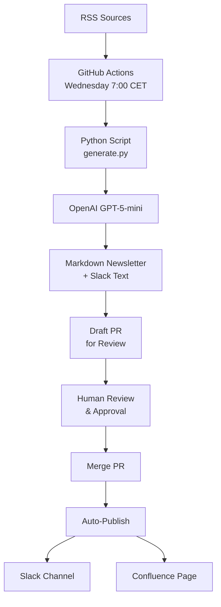

# MitiMind AI Newsletter Automation

Automated AI newsletter system for Mitigram's Product-Led Development transformation. This system curates, summarizes, and generates weekly AI newsletters with 90-95% automation and human-in-the-loop review.

## 🎯 Purpose

Support Mitigram's transition from "Feature Factory" to Product-Led Development by:
- Increasing AI literacy across all departments (business, tech, product, design)
- Encouraging innovation and cross-pollination of ideas
- Providing real-time industry awareness for data-driven decision-making
- Empowering autonomous, cross-functional teams with relevant AI knowledge

## 🚀 How It Works



### Workflow Steps
1. **Scheduled Trigger** - GitHub Actions runs every Wednesday at 7:00 AM CET (6:00 AM UTC)
2. **Feed Fetching** - Pulls latest content from curated AI and trade finance sources
3. **Content Ranking** - Scores items based on relevance to PLD transformation
4. **AI Summarization** - OpenAI GPT-5-mini creates newsletter draft with structured sections
5. **Quality Gates** - Validates word count, source links, and required sections
6. **PR Creation** - Automatically opens draft PR for human review and approval
7. **Publication** - After PR merge, auto-publishes to Slack and Confluence

## 📋 Setup Instructions

### 1. Repository Setup
```bash
# Clone or ensure this directory structure exists:
miti-ai-newsletter/
├── .github/workflows/
│   ├── newsletter.yml    # Generation workflow
│   └── publish.yml       # Publishing workflow
├── scripts/
│   ├── generate.py       # Main generation script
│   └── format_slack.py   # Slack formatting utility
├── sources.yml           # RSS feed configuration
├── requirements.txt      # Python dependencies
├── newsletter/           # Auto-created output directory
├── CONFIG.md            # Configuration guide
├── STAGING_GUIDE.md     # Environment setup guide
└── README.md
```

### 2. GitHub Configuration

#### Required Secrets
Add these in **Settings → Secrets and Variables → Actions → Secrets**:
- `OPENAI_API_KEY` - Your OpenAI API key with GPT-5-mini access
- `SLACK_BOT_TOKEN` - Slack app bot token for posting newsletters
- `CONFLUENCE_BASE_URL` - Your Confluence base URL (e.g., https://company.atlassian.net)
- `CONFLUENCE_USER` - Confluence user email
- `CONFLUENCE_API_TOKEN` - Confluence API token
- `CONFLUENCE_SPACE_KEY` - Target space key for newsletters
- `PR_TOKEN` - GitHub personal access token for creating PRs

#### Optional Variables
Add these in **Settings → Secrets and Variables → Actions → Variables**:
- `SLACK_CHANNEL_TEST` - Test Slack channel (default: #ai-publish-test)
- `SLACK_CHANNEL_PRODUCTION` - Production Slack channel (default: #mitigram-ai)

#### Repository Permissions
Ensure GitHub Actions has permission to:
- Read repository contents
- Create pull requests  
- Write to repository (Settings → Actions → General → Workflow permissions)

### 3. Customization

#### RSS Sources (`sources.yml`)
Current sources are categorized by:
- **Trade Finance & Fintech** - Industry-specific news
- **AI & Technology** - Core AI developments
- **Business & Strategy** - Transformation insights
- **Product & Development** - PLD methodologies

Add/remove sources as needed for your organization's focus areas.

#### Content Scoring (`scripts/generate.py`)
The ranking algorithm prioritizes content with keywords relevant to:
- AI/ML technologies (weight: 3)
- Business transformation terms (weight: 2) 
- Industry terms (weight: 1)
- PLD-specific terms (weight: 2)

#### Newsletter Template
The AI generates structured content with these sections:
1. **AI in Trade Finance** - Industry-specific developments
2. **Tip of the Week** - Actionable insights
3. **Internal Spotlight** - Suggested internal experiments
4. **Quick Hits** - Brief industry updates (3 bullets)
5. **CTA** - Call-to-action for pilots/engagement

## 🔧 Manual Execution

### Local Testing
```bash
# Install dependencies
pip install -r requirements.txt

# Set environment variable
export OPENAI_API_KEY="your-api-key-here"

# Generate newsletter
cd scripts
python generate.py
```

### GitHub Actions Manual Triggers

#### Generate Newsletter (Testing)
1. Go to **Actions → Generate AI Newsletter → Run workflow**
2. Choose options:
   - **Skip PR and commit directly**: For testing only
   - **Target environment**: `test` (posts to test Slack) or `production`

#### Publish Newsletter (Manual)
1. Go to **Actions → Publish Newsletter → Run workflow**
2. Choose environment: `test` or `production`

See [STAGING_GUIDE.md](STAGING_GUIDE.md) for detailed environment workflow.

## 📊 Quality Controls

### Automated Validation
- **Word Limit**: Maximum 400 words to ensure conciseness
- **Source Links**: Minimum 3 URLs required for credibility
- **Required Sections**: Must include core newsletter sections
- **Content Scoring**: Prioritizes PLD-relevant content

### Human Review Process
Each generated newsletter creates a **draft PR** with:
- ✅ Review checklist for content accuracy and tone
- 🎯 Purpose reminder linking to PLD transformation
- 📋 Clear next steps for approval process

## 🚀 Current Features

### ✅ Implemented
- **Automated Generation** - Wednesday 7:00 CET schedule
- **Multi-Platform Publishing** - Slack and Confluence integration
- **Environment Management** - Test vs production workflows
- **Human Review Process** - PR-based approval workflow
- **Quality Controls** - Word limits, source validation, section requirements
- **Flexible Configuration** - Configurable channels and sources

### 🔮 Future Enhancements
- **Trend Analysis** - Multi-week content analysis and insights
- **Engagement Metrics** - Track readership and topic interest
- **Dynamic Sources** - AI-powered source discovery and validation
- **Email Integration** - Direct email newsletter distribution
- **Analytics Dashboard** - Newsletter performance tracking

## 🛠️ Troubleshooting

### Common Issues

**Newsletter Generation Fails**
- Check OpenAI API key is valid and has sufficient credits
- Verify GPT-5-mini model access (or change to gpt-4o-mini in `scripts/generate.py`)
- Review RSS sources are accessible in `sources.yml`
- Check GitHub Actions logs for specific errors

**Publishing Issues**
- Verify Slack bot is added to target channels
- Check Confluence API credentials and space permissions
- Ensure all required secrets are configured
- Review publish workflow logs for API errors

**Wrong Environment**
- Check commit message contains correct `[env:test]` or `[env:production]` tag
- Verify environment selection in manual workflow triggers
- See [STAGING_GUIDE.md](STAGING_GUIDE.md) for environment details

**PR Not Created**
- Ensure GitHub Actions has pull request permissions
- Check if `PR_TOKEN` secret has proper scope
- Verify newsletter files were generated successfully

### Configuration
For detailed configuration options, see:
- [CONFIG.md](CONFIG.md) - Complete configuration reference
- [STAGING_GUIDE.md](STAGING_GUIDE.md) - Environment setup guide

## 📚 Documentation

- **[README.md](README.md)** - This overview and setup guide
- **[CONFIG.md](CONFIG.md)** - Complete configuration reference
- **[STAGING_GUIDE.md](STAGING_GUIDE.md)** - Environment and testing guide

## 📧 Support

For issues with the newsletter automation system:
1. Check GitHub Actions workflow logs
2. Review configuration guides (CONFIG.md, STAGING_GUIDE.md)
3. Test manual execution locally first
4. Verify all secrets and variables are properly configured
5. Contact the AI enablement team for prompt/source adjustments

---

*Supporting Mitigram's Product-Led Development transformation through AI-powered knowledge sharing* 🚀
