# Trade Finance Newsletter Automation

Automated trade finance and fintech newsletter system for Product Marketing. This system curates, summarizes, and generates bi-weekly newsletters focused on trade finance industry developments for customers, prospects, and stakeholders.

## 🎯 Purpose

Support Product Marketing with industry intelligence by:
- Providing trade finance and fintech market insights
- Delivering competitive landscape updates
- Sharing industry trends and opportunities
- Positioning thought leadership in the trade finance space

## 🚀 How It Works

```mermaid
flowchart TD
    A["📡 RSS Feed Sources<br/>(8 Trade Finance Feeds)"] --> B["🔍 Content Fetching<br/>& Deduplication"]
    
    B --> C["📊 Content Ranking<br/>Trade Finance Keywords<br/>Source Diversity (Max 1/source)"]
    
    C --> D["🤖 AI Processing<br/>OpenAI GPT-5-mini<br/>Generate Slack Format"]
    
    D --> E["✅ Quality Validation<br/>• Format Compliance<br/>• Source Diversity<br/>• 3-5 Bullets"]
    
    E --> F["📅 Trigger Modes"]
    
    F --> G["⏰ Bi-weekly Cron<br/>(Tuesday 9AM CET)"]
    F --> H["🚀 Manual Trigger<br/>(GitHub Actions)"]
    
    G --> I["📱 Direct Slack Post<br/>SLACK_CHANNEL Variable"]
    H --> I
    
    I --> J["👥 Product Marketing<br/>Review in Slack"]
    
    J --> K["📤 Manual Distribution<br/>External Channels"]
    
    style A fill:#e1f5fe
    style D fill:#f3e5f5
    style I fill:#e8f5e8
```



### Generation Modes

#### **⏰ Scheduled Mode (Bi-weekly)**
1. **Bi-weekly Trigger** - Every other Tuesday at 9:00 AM CET (8:00 AM UTC)
2. **Creates**: `newsletter/2025-01-15_slack.txt` (Slack-ready format)
3. **Auto-posts** directly to configured Slack channel
4. **Best for**: Regular industry intelligence updates

#### **🚀 Manual Mode (On-demand)**
1. **Manual Trigger** - Via GitHub Actions "Run workflow" button
2. **Creates**: `newsletter/2025-01-15_slack.txt` (same format)
3. **Posts immediately** to configured Slack channel
4. **Best for**: Testing, urgent updates, or ad-hoc generation

### Workflow Steps
1. **Feed Fetching** - Pulls latest content from trade finance and fintech sources
2. **Content Ranking** - Scores items based on trade finance relevance and market impact
3. **AI Summarization** - OpenAI GPT-5-mini creates newsletter draft for marketing audience
4. **Quality Gates** - Validates format compliance and source diversity
5. **Direct Publishing** - Posts formatted newsletter directly to Slack channel
6. **Human Review** - Product Marketing team reviews and distributes as needed

## 📋 Setup Instructions

### 1. Repository Setup
```bash
# Directory structure:
miti-marketing-newsletter/
├── .github/workflows/
│   └── trade-finance-newsletter.yml  # Simplified workflow
├── scripts/
│   ├── generate.py       # Main generation script
│   └── format_slack.py   # Slack formatting utility
├── sources.yml           # RSS feed configuration (trade finance focused)
├── requirements.txt      # Python dependencies
├── newsletter/           # Auto-created output directory
└── README.md
```

### 2. GitHub Configuration

#### Required Secrets
Add these in **Settings → Secrets and Variables → Actions → Secrets**:
- `OPENAI_API_KEY` - Your OpenAI API key with GPT-5-mini access
- `SLACK_BOT_TOKEN` - Slack app bot token for posting newsletters

#### Required Variables
Add these in **Settings → Secrets and Variables → Actions → Variables**:
- `SLACK_CHANNEL` - Target Slack channel (e.g., `#anish-ai-new`, `#product-marketing-ai`)

#### Repository Permissions
Ensure GitHub Actions has permission to:
- Read repository contents
- Access secrets (Settings → Actions → General → Workflow permissions)

### 3. Slack Channel Configuration

#### To Set the Target Channel:
1. Go to **Settings → Secrets and Variables → Actions → Variables**
2. Click **"New repository variable"**
3. Name: `SLACK_CHANNEL`
4. Value: Your desired channel (e.g., `#anish-ai-new`, `#product-marketing-ai`)
5. Click **"Add variable"**

**Note**: The channel name must include the `#` prefix. This variable is required for the workflow to function.

### 4. Customization

#### RSS Sources (`sources.yml`)
Current sources focus on trade finance and fintech:
- **Finextra** - Financial technology news and analysis
- **Trade Finance Global** - Trade finance industry updates
- **TLDR Fintech** - Fintech news digest

*Product Marketing team will provide additional sources as needed.*

#### Newsletter Template
The AI generates a clean, scannable format optimized for quick consumption:

**Structure:**
```
*Headline insight/trend* – One-line interpretation

Optional contextual expansion (max 2 sentences with key emphasis).

• Entity/Company action/outcome with metrics – <URL|Source Name>
• Entity/Company action/outcome with metrics – <URL|Source Name>  
• Entity/Company action/outcome with metrics – <URL|Source Name>
```

**Key Features:**
- **Single focused theme** with 3-5 specific news items
- **Slack-ready format** with hidden URL links  
- **Source diversity** - each bullet uses a different source
- **Concrete metrics** - funding amounts, percentages, deal sizes
- **Under 200 words** for rapid scanning

## 🔧 Manual Execution

### Local Testing
```bash
# Install dependencies
pip install -r requirements.txt

# Set environment variables
export OPENAI_API_KEY="your-api-key-here"

# Generate newsletter
cd scripts
python generate.py
```

### GitHub Actions Manual Workflow

#### 📰 Generate Newsletter Manually
1. Go to **Actions → Generate Trade Finance Newsletter → Run workflow**
2. Click **"Run workflow"** to generate and post immediately
3. Newsletter will be generated and posted directly to Slack channel

#### ⏰ Scheduled Newsletter
- Runs automatically every other Tuesday at 9:00 AM CET
- No manual intervention required
- Posts directly to Slack channel

## 📊 Quality Controls

### Automated Validation
- **Format Compliance**: Ensures proper headline and bullet structure
- **Source Diversity**: Validates each bullet uses a different source
- **Slack Link Format**: Confirms URLs are properly formatted as `<URL|Source>`
- **Content Scoring**: Prioritizes trade finance and fintech relevant content
- **Length Control**: Maintains under 200 words for quick scanning
- **Bullet Count**: Ensures 3-5 bullet points for optimal readability

### Human Review Process
- Newsletter posts directly to configured Slack channel
- Product Marketing team reviews content in Slack
- Team makes adjustments and distributes manually as needed
- No technical workflow required - simple Slack-based review

## 🚀 Current Features

### ✅ Implemented
- **Bi-weekly Scheduling** - Automated generation every other Tuesday
- **Manual Generation** - On-demand newsletter capability 
- **Configurable Slack Publishing** - Posts directly to specified Slack channel
- **Trade Finance Focus** - Curated sources specific to trade finance and fintech
- **Marketing Audience** - Content tailored for customers, prospects, and stakeholders
- **Ultra-Scannable Format** - Single theme with 3-5 focused bullet points
- **Perfect Source Diversity** - Each bullet uses a different source (no duplicates)
- **Simplified Workflow** - No PR reviews or Confluence - straight to Slack
- **Smart Content Ranking** - Prioritizes trade finance relevance and market impact
- **Slack-Ready Output** - Pre-formatted with hidden URL links
- **Concrete Metrics** - Emphasizes funding amounts, deal sizes, percentages
- **Quality Validation** - Ensures format compliance and source diversity
- **Robust Error Handling** - Timeout protection and retry logic for API calls

### 🔮 Future Enhancements  
- **Additional Sources** - More trade finance feeds as provided by Product Marketing
- **Engagement Tracking** - Monitor Slack engagement and feedback
- **Email Integration** - Optional email distribution for external stakeholders
- **Content Analytics** - Track trending topics and industry focus areas

## 🛠️ Troubleshooting

### Common Issues

**Newsletter Generation Fails**
- Check OpenAI API key is valid and has sufficient credits
- Verify GPT-5-mini model access (or change to gpt-4o-mini in `scripts/generate.py`)
- Review RSS sources are accessible in `sources.yml`
- Check GitHub Actions logs for specific errors

**Slack Posting Issues**
- Verify `SLACK_CHANNEL` GitHub variable is set with the correct channel name
- Verify Slack bot is added to the target channel specified in `SLACK_CHANNEL` variable
- Check `SLACK_BOT_TOKEN` secret is configured correctly
- Ensure bot has permission to post messages in the channel
- Review workflow logs for Slack API errors

**Bi-weekly Schedule Issues**
- Check if week number logic needs adjustment for your desired start date
- Verify cron schedule in `.github/workflows/trade-finance-newsletter.yml`
- Use manual trigger to override schedule when needed

## 📚 Documentation

- **[README.md](README.md)** - This setup and usage guide
- **[FEED_VALIDATION_GUIDE.md](FEED_VALIDATION_GUIDE.md)** - Guide for validating RSS feeds

## 📧 Support

For issues with the newsletter system:
1. Check GitHub Actions workflow logs
2. Test manual execution locally first  
3. Verify all secrets are properly configured
4. Contact Product Marketing team for source adjustments

---

*Supporting Product Marketing with automated trade finance industry intelligence* 📈