# MitiMind AI Newsletter Automation

Automated AI newsletter system for Mitigram's Product-Led Development transformation. This system curates, summarizes, and generates weekly AI newsletters with 90-95% automation and human-in-the-loop review.

## 🎯 Purpose

Support Mitigram's transition from "Feature Factory" to Product-Led Development by:
- Increasing AI literacy across all departments (business, tech, product, design)
- Encouraging innovation and cross-pollination of ideas
- Providing real-time industry awareness for data-driven decision-making
- Empowering autonomous, cross-functional teams with relevant AI knowledge

## 🚀 How It Works

```mermaid
flowchart LR
    A["RSS Sources"] --> B{"Newsletter Generation"}
    
    B --> C["⏰ Scheduled<br/>(Weekly Cron)"]
    B --> D["🚀 Manual Production<br/>(Production Mode ✓)"]  
    B --> E["🧪 Manual Test<br/>(Production Mode ✗)"]
    
    C --> F["newsletter/2025-01-15.md<br/>📰 Scheduled File"]
    D --> G["newsletter/2025-01-15-manual-HHMMSS.md<br/>🚀 Manual Production File"]
    E --> H["newsletter/2025-01-15-test-HHMMSS.md<br/>🧪 Test File"]
    
    F --> I["✅ Auto-Publish on Merge<br/>PRODUCTION"]
    G --> J["❌ No Auto-Publish<br/>Manual Control Required"]
    H --> K["❌ No Auto-Publish<br/>Safe for Testing"]
    
    J --> L["🚀 Manual Publish Workflow<br/>Choose: Production"]
    K --> M["🧪 Manual Publish Workflow<br/>Choose: Test"]
    
    I --> N["📖 Production Confluence<br/>📱 Production Slack"]
    L --> N
    M --> O["📖 Test Confluence<br/>📱 Test Slack"]
```



### Generation Modes

#### **⏰ Scheduled Mode (Auto-Publish)**
1. **Weekly Trigger** - Every Wednesday at 7:00 AM CET (6:00 AM UTC)
2. **Creates**: `newsletter/2025-01-15.md` (clean production format)
3. **Auto-publishes** when PR is merged to main
4. **Best for**: Regular weekly newsletters

#### **🚀 Manual Production Mode (Manual Control)**
1. **Manual Trigger** with "Production Mode" checkbox ✅
2. **Creates**: `newsletter/2025-01-15-manual-HHMMSS-123.md`
3. **Requires manual publish** workflow after merge
4. **Best for**: Emergency posts, special announcements

#### **🧪 Manual Test Mode (Safe Testing)**
1. **Manual Trigger** without "Production Mode" (default)
2. **Creates**: `newsletter/2025-01-15-test-HHMMSS-123.md`
3. **Never auto-publishes** - safe for experimentation
4. **Best for**: Testing, content experiments, training

### Common Workflow Steps
1. **Feed Fetching** - Pulls latest content from curated AI and trade finance sources
2. **Content Ranking** - Scores items based on business relevance (with arXiv penalty for source diversity)
3. **AI Summarization** - OpenAI GPT-5-mini creates newsletter draft with educational, multi-department focus
4. **Quality Gates** - Validates source links and required sections (flexible word count)
5. **PR Creation** - Automatically opens draft PR for human review and approval
6. **Publication** - Via auto-publish (scheduled) or manual publish workflow (manual/test modes)

## 📋 Setup Instructions

### 1. Repository Setup
```bash
# Clone or ensure this directory structure exists:
miti-ai-newsletter/
├── .github/workflows/
│   ├── newsletter.yml    # Generation workflow
│   └── publish.yml       # Publishing workflow
├── scripts/
│   ├── generate.py       # Main generation script
│   └── format_slack.py   # Slack formatting utility
├── sources.yml           # RSS feed configuration
├── requirements.txt      # Python dependencies
├── newsletter/           # Auto-created output directory
├── CONFIG.md            # Configuration guide
├── STAGING_GUIDE.md     # Environment setup guide
└── README.md
```

### 2. GitHub Configuration

#### Required Secrets
Add these in **Settings → Secrets and Variables → Actions → Secrets**:
- `OPENAI_API_KEY` - Your OpenAI API key with GPT-5-mini access
- `SLACK_BOT_TOKEN` - Slack app bot token for posting newsletters
- `CONFLUENCE_BASE_URL` - Your Confluence base URL (e.g., https://company.atlassian.net)
- `CONFLUENCE_USER` - Confluence user email
- `CONFLUENCE_API_TOKEN` - Confluence API token
- `CONFLUENCE_SPACE_KEY` - Target space key for newsletters
- `PR_TOKEN` - GitHub personal access token for creating PRs

#### Optional Variables
Add these in **Settings → Secrets and Variables → Actions → Variables**:
- `SLACK_CHANNEL_TEST` - Test Slack channel (default: #ai-publish-test)
- `SLACK_CHANNEL_PRODUCTION` - Production Slack channel (default: #mitigram-ai)

#### Repository Permissions
Ensure GitHub Actions has permission to:
- Read repository contents
- Create pull requests  
- Write to repository (Settings → Actions → General → Workflow permissions)

### 3. Customization

#### RSS Sources (`sources.yml`)
Current sources are categorized by:
- **Trade Finance & Fintech** - Industry-specific news (Finextra, Trade Finance Global, TLDR Fintech)
- **AI & Technology** - Core AI developments (OpenAI, Microsoft, Hugging Face, TLDR AI)
- **AI Research Papers** - Academic research (arXiv cs.AI, cs.LG with diversity controls)
- **Business & Strategy** - Strategic insights (a16z Future, TLDR Product)

Add/remove sources as needed for your organization's focus areas.

#### Content Scoring (`scripts/generate.py`)
The ranking algorithm prioritizes content with keywords relevant to:
- Core AI technologies (ai, artificial intelligence, model, llm, machine learning)
- Trade finance and banking (trade finance, swift, payments, treasury, banking, kyc, aml)
- Risk and compliance (sanctions, regulation, governance, regtech, fincrime)
- Business context (customer, b2b, saas)
- **Source diversity control**: arXiv scores reduced by 30% to prevent academic dominance

#### Newsletter Template
The AI generates structured content with these sections:
1. **Market Intelligence** - Major AI/fintech developments with business impact
2. **Business Impact** - Clear implications for revenue, costs, and competitive positioning
3. **What Different Teams Should Know** - Role-specific insights for Sales, Marketing, Product, Customer Success, Engineering
4. **Market Pulse** - Brief industry updates (3 bullets)
5. **Recommended Actions** - Specific, time-bound actions with clear ownership

## 🔧 Manual Execution

### Local Testing
```bash
# Install dependencies
pip install -r requirements.txt

# Set environment variables
export OPENAI_API_KEY="your-api-key-here"

# Generate different types of newsletters
cd scripts

# Test mode (safe, won't auto-publish)
TEST_MODE=1 python generate.py

# Manual production mode (won't auto-publish)  
MANUAL_MODE=1 python generate.py

# Scheduled mode (will auto-publish when merged)
python generate.py
```

### GitHub Actions Manual Workflows

#### 📰 Generate Newsletter
1. Go to **Actions → Generate AI Newsletter → Run workflow**
2. Choose mode:
   - **✅ Production Mode**: Creates manual production file (requires manual publish)
   - **❌ Production Mode** (default): Creates test file (safe for experimentation)

#### 🚀 Publish Newsletter  
1. Go to **Actions → Publish Newsletter → Run workflow**
2. **Discover available newsletters**:
   - ✅ Check "Just list available newsletters" → See all available files
   - Copy the date you want to publish
3. **Publish specific newsletter**:
   - Enter `newsletter_date` (e.g., "2025-01-15")
   - Choose `environment`: `test` or `production`
4. **Publish latest newsletter**:
   - Leave `newsletter_date` empty
   - Choose `environment`: `test` or `production`

#### 🔍 Discovery Workflow
```
1. Actions → Publish Newsletter
2. ✅ Check "Just list available newsletters"  
3. Run → See organized list of all newsletters
4. Copy date/filename for targeted publishing
```

See [STAGING_GUIDE.md](STAGING_GUIDE.md) for detailed environment workflow.

## 📊 Quality Controls

### Automated Validation
- **Source Links**: Minimum 3 URLs required for credibility
- **Required Sections**: Must include Market Intelligence, Business Impact, and Team-specific sections
- **Content Scoring**: Prioritizes business-relevant content with source diversity controls
- **Word Count Logging**: Tracks length without blocking generation (flexible approach)

### Human Review Process
Each generated newsletter creates a **draft PR** with:
- ✅ Review checklist for content accuracy and tone
- 🎯 Purpose reminder linking to PLD transformation
- 📋 Clear next steps for approval process

## 🚀 Current Features

### ✅ Implemented
- **Three Generation Modes** - Scheduled (auto-publish), Manual Production (manual control), Test (safe experimentation)
- **Smart File Naming** - Unique timestamps with collision prevention for manual/test files
- **Intelligent Publishing** - Auto-publish only for scheduled files, manual control for everything else
- **Newsletter Discovery** - Built-in file browser to list and select available newsletters
- **Flexible Targeting** - Publish specific dates or latest newsletters with environment choice
- **Multi-Platform Publishing** - Slack and Confluence integration with link unfurling disabled
- **Environment Management** - Test vs production workflows with GitHub Variables configuration
- **Human Review Process** - PR-based approval workflow with clear mode indicators
- **Educational Focus** - Technical terms explained for all departments (Sales, Marketing, Product, CS, Engineering)
- **Source Diversity** - 12 curated feeds with arXiv penalty to prevent academic dominance
- **Robust Error Handling** - 180s timeout + retry logic for OpenAI API calls, missing file recovery
- **Custom Messaging** - Manually editable announcement section with visual separators
- **Path Filtering Safety** - Code changes never trigger auto-publish, only scheduled newsletter content

### 🔮 Future Enhancements
- **Trend Analysis** - Multi-week content analysis and insights
- **Engagement Metrics** - Track readership and topic interest
- **Dynamic Sources** - AI-powered source discovery and validation
- **Email Integration** - Direct email newsletter distribution
- **Analytics Dashboard** - Newsletter performance tracking

## 🛠️ Troubleshooting

### Common Issues

**Newsletter Generation Fails**
- Check OpenAI API key is valid and has sufficient credits
- Verify GPT-5-mini model access (or change to gpt-4o-mini in `scripts/generate.py`)
- Review RSS sources are accessible in `sources.yml`
- Check GitHub Actions logs for specific errors

**Publishing Issues**
- Verify Slack bot is added to target channels
- Check Confluence API credentials and space permissions
- Ensure all required secrets are configured
- Review publish workflow logs for API errors

**Wrong Environment**
- Use manual publish workflow to choose environment explicitly
- Check GitHub Variables: `SLACK_CHANNEL_PRODUCTION` and `SLACK_CHANNEL_TEST`
- See [STAGING_GUIDE.md](STAGING_GUIDE.md) for environment details

**PR Not Created**
- Ensure GitHub Actions has pull request permissions
- Check if `PR_TOKEN` secret has proper scope
- Verify newsletter files were generated successfully

### Configuration
For detailed configuration options, see:
- [CONFIG.md](CONFIG.md) - Complete configuration reference
- [STAGING_GUIDE.md](STAGING_GUIDE.md) - Environment setup guide

## 📚 Documentation

- **[README.md](README.md)** - This overview and setup guide
- **[CONFIG.md](CONFIG.md)** - Complete configuration reference
- **[STAGING_GUIDE.md](STAGING_GUIDE.md)** - Environment and testing guide
- **[FEED_VALIDATION_GUIDE.md](FEED_VALIDATION_GUIDE.md)** - Step-by-step guide for validating RSS feeds

## 📧 Support

For issues with the newsletter automation system:
1. Check GitHub Actions workflow logs
2. Review configuration guides (CONFIG.md, STAGING_GUIDE.md)
3. Test manual execution locally first
4. Verify all secrets and variables are properly configured
5. Contact the AI enablement team for prompt/source adjustments

---

*Supporting Mitigram's Product-Led Development transformation through AI-powered knowledge sharing* 🚀
